# Pi-Hole custom.list Synchronizer

Small shell script to fetch and synchronize custom DNS lists for Pi-hole.

## Repository

This repository contains a single script:

- `sync-from-web.sh` — fetches remote custom.list and updates local Pi-hole custom.list file.

## Requirements

- Bash (Linux/macOS/WSL)
- `wget` or `curl` (the script will use whichever is available)

## How It Works

The `sync-from-web.sh` script synchronizes custom DNS entries from a primary Pi-hole server to secondary Pi-hole instances. It:

1. **Downloads** the custom.list file from the primary server via HTTP
2. **Compares** the downloaded file with the local copy to detect changes
3. **Updates** the local custom list only if differences are detected
4. **Restarts** the DNS service to apply new rules

### Script Flow

- **Downloads** `custom.list` from the primary Pi-hole via HTTP:
  - Attempts `wget -q` (quiet mode) first if available
  - Falls back to `curl -s` (silent mode) if wget is not installed
  - Exits with error if neither tool is available
- **Validates** the download was successful and the file is non-empty
- **Compares** the new file with the existing local copy using `cmp` (silent mode)
- If **changes are detected**:
  - Replaces the old custom list with the downloaded file
  - Restarts Pi-hole DNS service (`sudo pihole restartdns`)
- If **no changes detected** or **download fails**:
  - Cleans up temporary files automatically


## Why Use This Script?

If you're running a small home lab with multiple Pi-hole instances, you likely need custom DNS entries to be resolvable across your entire local network. This script solves that problem by automatically synchronizing custom DNS lists from a primary Pi-hole server to secondary instances.

**Key Benefits:**
- **Centralized DNS Management**: Maintain your custom DNS entries in one place (primary Pi-hole) and automatically push them to all secondary servers
- **Ad Blocking & Content Filtering**: Leverage Pi-hole's powerful blocklist capabilities to filter ads and malicious content without ISP restrictions
- **Alternative DNS Providers**: Use DNS providers of your choice (Quad9, Cloudflare, OpenDNS, etc.) instead of being limited to your ISP's DNS servers
- **Local Network Resolution**: Resolve custom hostnames and internal services across your home lab network seamlessly
- **Automated Synchronization**: No more manual configuration on each Pi-hole instance—changes sync automatically via cron

### Architecture & Data Flow

```mermaid
graph LR
    A["📝 Admin<br/>Adds Custom<br/>DNS Entry"] -->|Edit custom.list| B["🔵 Primary Pi-hole<br/>Server"]
    B -->|HTTP GET<br/>/custom.list| C["📂 Lighttpd<br/>Web Server<br/>/var/www/html/"]
    C -->|custom.list<br/>File| D["🔄 Sync Script<br/>on Secondary"]
    D -->|Compare &<br/>Update| E["🔵 Secondary<br/>Pi-hole #1"]
    D -->|Compare &<br/>Update| F["🔵 Secondary<br/>Pi-hole #2"]
    D -->|Compare &<br/>Update| G["🔵 Secondary<br/>Pi-hole #N"]
    E -->|DNS Queries| H["🖥️ Local Network<br/>Clients"]
    F -->|DNS Queries| H
    G -->|DNS Queries| H
    
    style B fill:#4CAF50,color:#fff
    style E fill:#2196F3,color:#fff
    style F fill:#2196F3,color:#fff
    style G fill:#2196F3,color:#fff
    style D fill:#FF9800,color:#fff
    style H fill:#9C27B0,color:#fff
```



## Setup Instructions

### 1. Symlink custom.list (on primary server)

Run this command on your **primary Pi-hole server** to expose the custom list via HTTP:

```bash
ln -s /etc/pihole/custom.list /var/www/html/custom.list
```

**Note:** Pi-hole uses **lighttpd** as its web server. The symlink places the custom list file in the lighttpd web root directory (`/var/www/html/`), making it accessible via HTTP on the primary server.

### 2. Install script into secondary server(s)

SSH into the secondary Pi-hole server and create the file:

```bash
ssh pi@<secondary-pihole>
sudo nano /usr/local/bin/sync-from-web.sh
```

Then paste the script content, save with `Ctrl+O`, press Enter, and exit with `Ctrl+X`. Finally, make it executable:

```bash
sudo chmod +x /usr/local/bin/sync-from-web.sh
```

### 3. Configure the primary server IP

Edit the script and update this line with your primary Pi-hole IP or hostname:

```bash
PRIMARY_PIHOLE_HOST="10.0.0.2"  # Change this to your primary Pi-hole
```

### 4. Create a cron job (optional but recommended)

Run the script automatically to sync changes from the primary server to secondary server(s). Any changes made to the custom.list on the primary Pi-hole server will be automatically applied to secondary servers when the cron job executes.

Run the script every 15 minutes:

```bash
# Create the crontab file if it doesn't exist
sudo touch /var/spool/cron/crontabs/root
sudo chmod 600 /var/spool/cron/crontabs/root

# Add the following line to the crontab:
*/15 * * * * /usr/local/bin/sync-from-web.sh >/dev/null 2>&1
```

To edit the crontab directly, use `crontab -e` and add:

```
*/15 * * * * /usr/local/bin/sync-from-web.sh >/dev/null 2>&1
```

## Usage

### Manual Execution

Run the script manually on any secondary Pi-hole server:

```bash
bash sync-from-web.sh
```

### Automated Execution

Once the cron job is set up, the script will run automatically every 15 minutes. To verify synchronization, check the timestamp of the custom.list file:

```bash
# Check when custom.list was last modified
stat /etc/pihole/custom.list

# Or check the file's modification time
ls -l /etc/pihole/custom.list
```

To troubleshoot, run the script manually with output to see if it executes correctly:

```bash
sudo /usr/local/bin/sync-from-web.sh
```

### Checking Syslog Messages

The script logs all activity to syslog. To view the messages:

```bash
# View recent syslog messages from the script
sudo grep "Pi-Hole Custom DNS Synchronizer" /var/log/syslog

# Or use journalctl for systemd-based systems
sudo journalctl -t "Pi-Hole Custom DNS Synchronizer"

# Follow logs in real-time
sudo tail -f /var/log/syslog | grep "Pi-Hole Custom DNS Synchronizer"
```

## Requirements

- **Primary Server**: Bash and web server access to `/var/www/html/`
- **Secondary Server(s)**: 
  - Bash shell
  - `wget` or `curl` for downloads
  - `sudo` privileges for DNS restart
  - Network access to primary Pi-hole server

## Notes

- The script uses `wget -q` (quiet mode) for downloads by default
- Falls back to `curl -s` (silent mode) if wget is not available
- Temporary files are cleaned up automatically on success or failure
- DNS service is only restarted if changes are detected (more efficient)
- Suitable for Pi-hole multi-device setups with a primary and secondary instances
- Ensure firewall rules allow HTTP access to the primary server on port 80
- **All script activity is logged to syslog** with the tag "Pi-Hole Custom DNS Synchronizer" for monitoring and troubleshooting
- **Security Note**: By default, the script runs as root when executed via crontab. For enhanced security, you can create a custom non-root user, configure specific `sudo` rules for the required commands (`mv`, `pihole restartdns`) using `sudoers`, and run the cron job with reduced privileges instead of full root access.

## License

This project is available under the terms of the LICENSE file in this repository.
